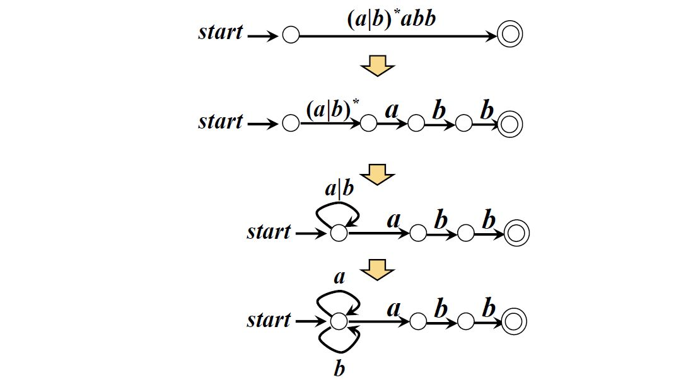

# 面试题19：正则表达式匹配

> 注：这道题真的就是先写了一个最普通的有限状态机，然后一点一点拿测试用例往里面打寻找代码的缺陷，不断调整代码去适应测试用例。

## 题目描述

请实现一个函数用来匹配包括'.'和'*'的正则表达式。模式中的字符'.'表示任意一个字符，而'*'表示它前面的字符可以出现任意次（包含0次）。 在本题中，匹配是指字符串的所有字符匹配整个模式。例如，字符串"aaa"与模式"a.a"和"ab*ac*a"匹配，但是与"aa.a"和"ab*a"均不匹配

## 解答

这道题使用有线状态机进行匹配：

* 首先使用两个指针进行匹配字符串和模式字符串遍历

~~~java
public class Solution {
    public boolean match(char[] str, char[] pattern) {
        return walkDouble(str, pattern, 0, 0);
    }

    public boolean walkDouble(char[] str, char[] pattern, int sindex, int pindex) {
        // 遍历完成
        if (sindex == str.length && pindex == pattern.length) {
            return true;
        }
        if (sindex < str.length && pindex < pattern.length) {
            switch (pattern[pindex]) {
                case '.':
                    return walkDouble(str, pattern, sindex + 1, pindex + 1);
                case '*':
                    if (sindex - 1 < 0) return false;
                    if (pattern[pindex - 1] != '.' 
                        && str[sindex] != pattern[pindex - 1]) {
                        return walkDouble(str, pattern, sindex, pindex + 1);
                    }
                    return walkDouble(str, pattern, sindex, pindex + 1) ||
                            walkDouble(str, pattern, sindex + 1, pindex);
                default:
                    if (str[sindex] != pattern[pindex]) {
                        // "aaa"和"ab*aa"
                        if (pindex + 1 < pattern.length 
                            && pattern[pindex + 1] == '*') {
                            return walkDouble(str, pattern, sindex, pindex + 2);
                        }
                        return false;
                    }
                    // “aaa”和“aa*aa”，其中第二个a出现零次，所以要看看下个元素是不是"*"
                    if (pindex + 1 < pattern.length && pattern[pindex + 1] == '*') {
                        return walkDouble(str, pattern, sindex, pindex+2)
                                || walkDouble(str, pattern, sindex+1, pindex+1);
                    }
                    return walkDouble(str, pattern, sindex + 1, pindex + 1);
            }
        }
        if (sindex == str.length && pindex != pattern.length) {
            while (pindex != pattern.length) {
                if (pattern[pindex] != '*' && 
                    (pindex + 1 >= pattern.length || pattern[pindex + 1] != '*')) {
                    return false;
                }
                pindex++;
            }
            return true;
        }
        return false;
    }
}
~~~

