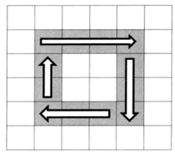
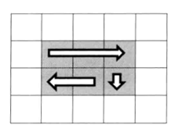
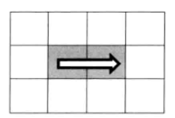
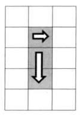

# 面试题29：顺时针打印矩阵

> 这题看着很简单，但是需要考虑很多终止条件，还有顺时针移动对边界的影响的逻辑性，反正debug了三个多小时，才出来。

## 题目描述

输入一个矩阵，按照从外向里以顺时针的顺序依次打印出每一个数字，例如，如果输入如下4 X 4矩阵： 1 2 3 4 5 6 7 8 9 10 11 12 13 14 15 16 则依次打印出数字1,2,3,4,8,12,16,15,14,13,9,5,6,7,11,10.

## 解答

这个是常规移动：

这个是提前退出的情况：

~~~java
import java.util.ArrayList;
public class Solution {
    public ArrayList<Integer> printMatrix(int[][] matrix) {
        int len = matrix.length;
        if (len < 1) return null;

        ArrayList<Integer> arrayList = new ArrayList<>();
        int boundOfLeft = -1;
        int boundOfRight = matrix[0].length;
        int boundOfUp = -1;
        int boundOfDown = matrix.length;
        int i = 0, j = 0;
        for (; boundOfDown > boundOfUp + 1 || boundOfRight > boundOfLeft+1;) {
            // to right
            while (j < boundOfRight) {
                arrayList.add(matrix[i][j]);
                // 当右移到边界的时候，需要向下移了（j不要再自加了，i加一下，然后右移造成上边界的下移，注意是下边界！！！！！！）
                if (j + 1 < boundOfRight){
                    j++;
                }else {
                    i++;
                    boundOfUp++;
                    break;
                }
            }
            // 下移不了了，说明全部遍历完成，所以直接退出，返回结果吧
            if (i >= boundOfDown) break;
            // to down
            while (i < boundOfDown){
                arrayList.add(matrix[i][j]);
                if (i + 1<boundOfDown){
                    i++;
                }else {
                    j--;
                    boundOfRight--;
                    break;
                }
            }
            if (j <= boundOfLeft) break;
            // to left
            while (j > boundOfLeft) {
                arrayList.add(matrix[i][j]);
                if (j - 1 > boundOfLeft){
                    j--;
                }else {
                    i--;
                    boundOfDown--;
                    break;
                }
            }
            if (i <= boundOfUp) break;
            // to up
            while (i > boundOfUp) {
                arrayList.add(matrix[i][j]);
                if (i -1 > boundOfUp){
                    i--;
                }else {
                    j++;
                    boundOfLeft++;
                    break;
                }
            }
            if (j >= boundOfRight) break;
        }
        return arrayList;
    }
}

~~~

