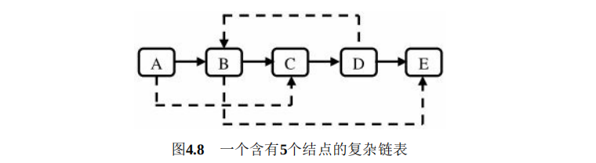
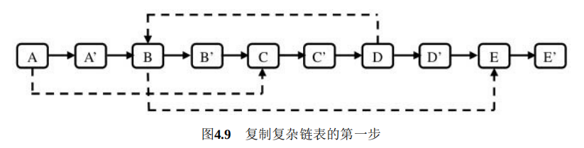
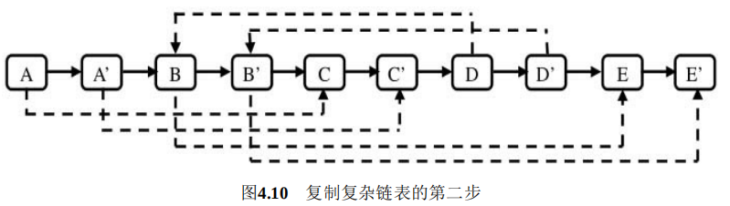
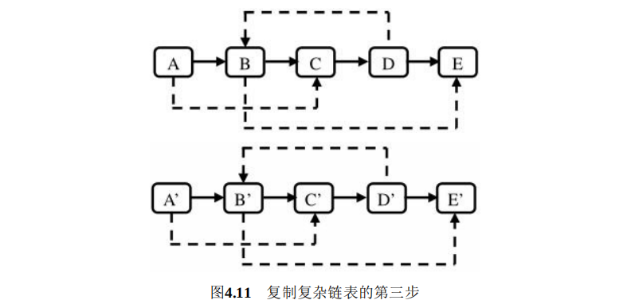

# 面试题35：复杂链表的复制

## 题目描述

输入一个复杂链表（每个节点中有节点值，以及两个指针，一个指向下一个节点，另一个特殊指针指向任意一个节点），返回结果为复制后复杂链表的head。（注意，输出结果中请不要返回参数中的节点引用，否则判题程序会直接返回空）

## 解答

原始链表：

先插入复制的新链表，一个旧一个新：

然后处理random的链表：

最后进行链表的拆分：

~~~java
public class Solution {
     public RandomListNode Clone(RandomListNode pHead) {
        if (pHead == null) return null;
        RandomListNode root = pHead;
        // the first step: just insert new node into this list
        // after this step, the list become "ord,new,ord,new' one by one
        while (pHead != null) {
            RandomListNode newNode = new RandomListNode(pHead.label);
            newNode.next = pHead.next;
            pHead.next = newNode;
            pHead = newNode.next;
        }
        pHead = root;
        // operator the randomindex
        while (pHead != null) {
            if (pHead.random != null) {
                pHead.next.random = pHead.random.next;
            }
            pHead = pHead.next.next;
        }
        pHead = root;
        // split the ord and the new list
        RandomListNode newHead = pHead.next;
        while (pHead != null) {
            RandomListNode node = pHead.next;
            pHead.next = node.next;
            node.next = pHead.next != null ? pHead.next.next : null;
            pHead = pHead.next;
        }
        return newHead;
    }
}
~~~

