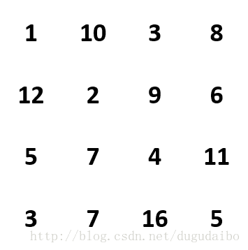

# 面试题47：礼物的最大价值

## 题目描述

在一个 m*n 的棋盘中的每一个格都放一个礼物，每个礼物都有一定的价值（价值大于0）.你可以从棋盘的左上角开始拿各种里的礼物，并每次向左或者向下移动一格，直到到达棋盘的右下角。给定一个棋盘及上面个的礼物，请计算你最多能拿走多少价值的礼物？

比如说现在有一个如下的棋盘，

在这个棋盘中，按照（1，12，5，7，7，16，5）的顺序可以拿到总价值最大的礼物。

## 解答

动归：

~~~java
public class Solution {
    public int getMaxValue(int[][] arrays) {
        int[][] dp = new int[arrays.length + 1][arrays[0].length + 1];

        for (int i = 1, j = 1; i <= arrays.length; i++) {
            j=1;
            for ( ;j<=arrays.length ; j++){
                dp[i][j] = arrays[i-1][j-1] + Math.max(dp[i-1][j], dp[i][j-1]);
            }
        }
        return dp[arrays.length][arrays[0].length];
    }
}
~~~

改进版的：

~~~java
public class Solution {
    public int getMaxValue(int[][] arrays) {
        int[] dp = new int[arrays[0].length + 1];

        for (int i = 1, j = 1; i <= arrays.length; i++) {
            j=1;
            for ( ;j<=arrays.length ; j++){
                dp[j] = arrays[i-1][j-1] + Math.max(dp[j-1], dp[j]);
            }
        }
        return dp[arrays[0].length];
    }
}
~~~

