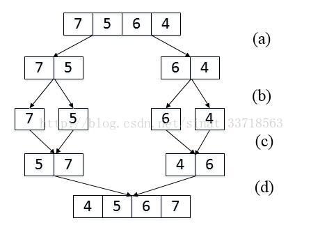

# 面试题51：数组中的逆序对

## 题目描述

在数组中的两个数字，如果前面一个数字大于后面的数字，则这两个数字组成一个逆序对。输入一个数组,求出这个数组中的逆序对的总数P。并将P对1000000007取模的结果输出。 即输出P%1000000007

## 输入描述:

```
题目保证输入的数组中没有的相同的数字数据范围：	
                        对于%50的数据,size<=10^4	
                        对于%75的数据,size<=10^5	
                        对于%100的数据,size<=2*10^5
```

## 解答

这道是归并排序的变种：



这是我写的归并排序，由于每次都要声明新的数组进行排序后的记录，Arrays.copyOfRange()方法的时间复杂度是$O(n)​$级别的，所以每次复制都比较耗时，所以只能通过50%的测试用例。

~~~java
import java.util.Arrays;
 
public class Solution {
    int num = 0;
 
    public int InversePairs(int[] array) {
        merge(array);
        return num;
    }
 
    public int[] merge(int[] arrays) {
        int len = arrays.length;
        if (len < 2) {
            return arrays;
        }
 
        int[] left = merge(Arrays.copyOfRange(arrays, 0, len / 2));
        int[] right = merge(Arrays.copyOfRange(arrays, len / 2, len));
        int lenL = left.length;
        int lenR = right.length;
        int[] result = new int[lenL + lenR];
 
        int indexL = 0;
        int indexR = 0;
        int indexResult = 0;
 
        while (indexL < lenL && indexR < lenR) {
            if (left[indexL] < right[indexR]) {
                result[indexResult++] = left[indexL++];
            } else {
                this.num = this.num + (lenL-indexL) % 1000000007;
                result[indexResult++] = right[indexR++];
            }
        }
 
        while (indexL < lenL) {
            result[indexResult++] = left[indexL++];
        }
 
        while (indexR < lenR) {
            result[indexResult++] = right[indexR++];
        }
        return result;
    }
}
~~~

这是别人写的，通过一个copy数组进行归并排序：

~~~java
import java.io.*;
import java.util.*;
public class Solution {
    int num = 0;
    public int InversePairs(int [] array) {
        if(array==null||array.length==0)
        {
            return 0;
        }
        int[] copy = new int[array.length];
        for(int i=0;i<array.length;i++)
        {
            copy[i] = array[i];
        }
        InversePairsCore(array,copy,0,array.length-1);//数值过大求余
        return num;

    }
    private  void InversePairsCore(int[] array,int[] copy,int low,int high)
    {
        if(low==high)
        {
            return;
        }
        int mid = (low+high)>>1;
        InversePairsCore(array,copy,low,mid);
        InversePairsCore(array,copy,mid+1,high);

        int i=mid;
        int j=high;
        int locCopy = high;
        while(i>=low&&j>mid)
        {
            if(array[i]>array[j])
            {
                num += j-mid;
                copy[locCopy--] = array[i--];
                if(num>=1000000007)//数值过大求余
                {
                    num%=1000000007;
                }
            }
            else
            {
                copy[locCopy--] = array[j--];
            }
        }
        for(;i>=low;i--)
        {
            copy[locCopy--]=array[i];
        }
        for(;j>mid;j--)
        {
            copy[locCopy--]=array[j];
        }
        System.arraycopy(copy, low, array, low, high + 1 - low);
    }
}
~~~

