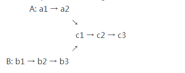

# 面试题52：两个链表的第一个公共结点

## 题目描述

输入两个链表，找出它们的第一个公共结点。

## 解答

如果两个单项链表有共同节点，那么它一定就是这种Y型结构。

~~~java
/*
public class ListNode {
    int val;
    ListNode next = null;

    ListNode(int val) {
        this.val = val;
    }
}*/
import java.util.Stack;
public class Solution {
    public ListNode FindFirstCommonNode(ListNode pHead1, ListNode pHead2) {
        Stack<ListNode> stack1 = new Stack<>();
        Stack<ListNode> stack2 = new Stack<>();

        while (pHead1 != null) {
            stack1.push(pHead1);
            pHead1 = pHead1.next;
        }
        while (pHead2 != null) {
            stack2.push(pHead2);
            pHead2 = pHead2.next;
        }

//        if (stack1.peek() != stack2.peek()) return null;

        ListNode last = null;
        while (!stack1.isEmpty()&&!stack2.isEmpty()&&stack1.peek()==stack2.peek()) {
            last = stack1.pop();
            stack2.pop();
        }

        return last;
    }
}
~~~

不使用辅助栈的;

~~~java
/*
public class ListNode {
    int val;
    ListNode next = null;

    ListNode(int val) {
        this.val = val;
    }
}*/
public class Solution {
   public ListNode FindFirstCommonNode(ListNode pHead1, ListNode pHead2) {
        int len1 = 0;
        int len2 = 0;

        ListNode p1 = pHead1;
        ListNode p2 = pHead2;
        while (pHead1 != null) {
            len1++;
            pHead1 = pHead1.next;
        }
        while (pHead2 != null) {
            len2++;
            pHead2 = pHead2.next;
        }
        if (len1 > len2) {
            while (len1-- > len2) {
                p1 = p1.next;
            }
        }else if (len1 < len2) {
            while (len2-- > len1) {
                p2 = p2.next;
            }
        }

        while (p1 != p2) {
            p1 = p1.next;
            p2 = p2.next;
        }
        return p1;
    }
}
~~~

