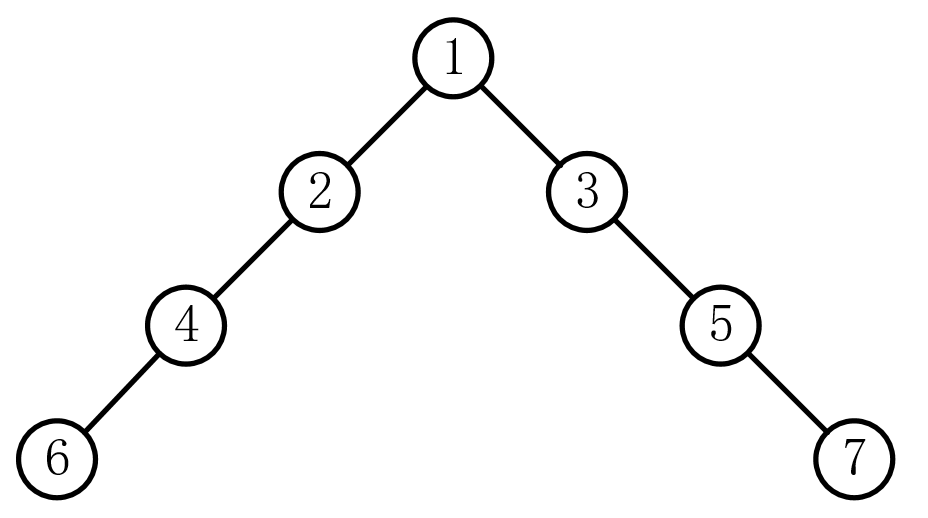

# 面试题55B：平衡二叉树

## 题目描述

输入一棵二叉树，判断该二叉树是否是平衡二叉树。

## 解答

复用了面试题55A的代码**（虽然能够通过，但是这个想法是不对的）**，下面这个就是个反例，结果还是输出True。

~~~java
public class Solution {
    public int TreeDepth(TreeNode root) {
        if (root == null) return 0;
        return Math.max(TreeDepth(root.left) + 1, TreeDepth(root.right) + 1);
    }

    public boolean IsBalanced_Solution(TreeNode root) {
        if (root == null) return true;
        return Math.abs(TreeDepth(root.left)-TreeDepth(root.right)) <= 1;
    }

}
~~~

这才是正确的答案，不过性能堪忧：

~~~java
public class Solution {
    public int TreeDepth(TreeNode root) {
        if (root == null) return 0;
        return Math.max(TreeDepth(root.left) + 1, TreeDepth(root.right) + 1);
    }

    public boolean IsBalanced_Solution(TreeNode root) {
        if (root == null) return true;
        return Math.abs(TreeDepth(root.left) - TreeDepth(root.right)) <= 1
                && IsBalanced_Solution(root.left) && IsBalanced_Solution(root.right);
    }
}
~~~

上面那个写法的性能不行的原因是每次访问一个树要算他的左右子树的高度差值，然后在判断其左子树的左右子树的高度差值，还有其右子树的左右子树的高度差值，也就是说是先序遍历，这样需要做很多重复性的工作。如果使用后序遍历，就避免了重复性工作。

~~~java
public class Solution {
    public boolean IsBalanced_Solution(TreeNode root) {
        boolean[] flag = new boolean[]{true};
        LRD(root, flag);
        return flag[0];
    }

    public int LRD(TreeNode node, boolean[] flag) {
        if (node == null) return 0;

        int Ldepth = LRD(node.left, flag);
        int Rdepth = LRD(node.right, flag);

        if (Math.abs(Ldepth - Rdepth) > 1) flag[0] = false;

        return Math.max(Ldepth, Rdepth) + 1;

    }
}
~~~

