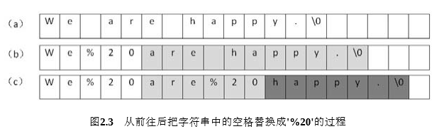

# 面试题5：替换空格

## 题目描述

请实现一个函数，将一个字符串中的每个空格替换成“%20”。例如，当字符串为We Are Happy.则经过替换之后的字符串为We%20Are%20Happy。

## 解答

~~~java
public class Solution {
    public String replaceSpace(StringBuffer str) {
        int len = str.length();
        if (len == 0) return str.toString();

        StringBuilder stringBuilder = new StringBuilder();

        for (int i = 0; i < len; i++){
            char current = str.charAt(i);
            if (current == ' '){
                stringBuilder.append("%20");
            }
            else {
                stringBuilder.append(current);
            }
        }

        return stringBuilder.toString();
    }
}
~~~

书上的意思是：

从前面进行替换会导致之后的元素向后移动，从而增加时间复杂度。

所以从后面往前面替换，不需要进行其他元素的移动。