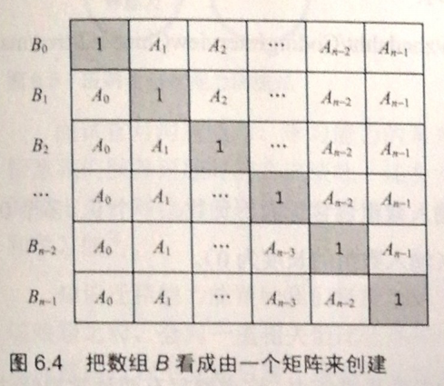

# 面试题66：构建乘积数组

## 题目描述

给定一个数组A[0,1,...,n-1],请构建一个数组B[0,1,...,n-1],其中B中的元素B[i]=A[0]*A[1]*...*A[i-1]*A[i+1]*...*A[n-1]。不能使用除法。

## 解答

如图所示，使用两个循环，第一个循环负责左下三角矩阵，第二个负责右上三角矩阵，时间复杂度为$O(n)$。

~~~java
import java.util.Arrays;

public class Solution {
    public int[] multiply(int[] A) {
//        B[i]=A[0]*A[1]*...*A[i-1]*A[i+1]*...*A[n-1]
        int[] B = new int[A.length];
        Arrays.fill(B, 1);
        for (int i = 1; i < A.length; i++) {
            B[i] = A[i - 1] * B[i - 1];
        }
        int tmp = 1;
        for (int i = A.length - 2; i >= 0; i--) {
            tmp *= A[i + 1];
            B[i] *= tmp;
        }
        return B;
    }
}
~~~

