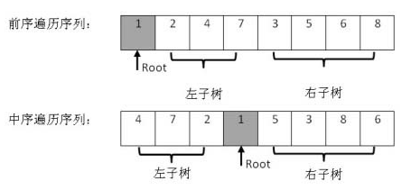

# 面试题7：重建二叉树

## 题目描述

输入某二叉树的前序遍历和中序遍历的结果，请重建出该二叉树。假设输入的前序遍历和中序遍历的结果中都不含重复的数字。例如输入前序遍历序列{1,2,4,7,3,5,6,8}和中序遍历序列{4,7,2,1,5,3,8,6}，则重建二叉树并返回。

## 解答

前序遍历的第一个元素代表当前的根节点，中序遍历中对应的元素将其分为两部分，左部分代表左子树，右部分代表右子树。

~~~java
public class Solution {
    public static TreeNode buildTree(int[] pre, int[] in) {
        TreeNode root = new TreeNode(pre[0]);

        int j = 0;
        for ( ; j < in.length; j++) {
            if (in[j] == pre[0]) break;
        }

        int[] childLpre = new int[j];
        for(int i = 0; i < j; i++){
            childLpre[i] = pre[i+1];
        }

        int[] childLin = new int[j];
        for (int i = 0; i<j; i++){
            childLin[i] = in[i];
        }

        int[] childRpre = new int[in.length-j-1];
        for(int i = 0; i<in.length-j-1; i++){
            childRpre[i] = pre[j+i+1];
        }

        int[] childRin = new int[in.length-j-1];
        for(int i = 0; i<in.length-j-1; i++){
            childRin[i] = in[j+i+1];
        }

        if (childLin.length > 0) root.left = buildTree(childLpre, childLin);
        if (childRin.length > 0) root.right = buildTree(childRpre, childRin);

        return root;
    }

    public TreeNode reConstructBinaryTree(int[] pre, int[] in) {
        return buildTree(pre, in);
    }
}
~~~

待完成：不使用额外数组

~~~java
import org.junit.Test;
public class Solution {
    public TreeNode reConstructBinaryTree(int[] pre, int[] in) {
        int lenPre = pre.length;
        int lenIn = in.length;

        if (lenPre <= 0 || lenIn <= 0) return null;

        return reConstruct(pre, in, 0, lenPre - 1, 0, lenIn - 1);
    }

    public TreeNode reConstruct(int[] pre, int[] in, int startP, int endP, int startI, int endI) {

        if (startI > endI || startP > endP) return null;

        TreeNode root = new TreeNode(pre[startP]);
        if (startI != endI) {
            int i = findNumber(in, startI, endI, pre[startP]);
            int des = i - startP;

            root.left = reConstruct(pre, in, startP + 1, 0, i + 1, endP);
            root.right = reConstruct(pre, in, 0, 0, 0, endI);
        }
        return root;
    }

    public int findNumber(int[] nums, int start, int end, int target) {
        for (int i = start; start <= end; i++) {
            if (target == nums[i]) return i;
        }

        return -1;
    }

    @Test
    public void test() {
        int[] pre = {1, 2, 4, 7, 3, 5, 6, 8};
        int[] in = {4, 7, 2, 1, 5, 3, 8, 6};
        TreeNode treeNode = reConstructBinaryTree(pre, in);
        System.out.println("");
    }
}
~~~

