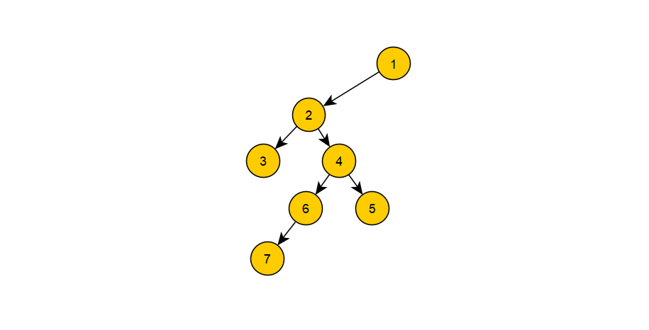
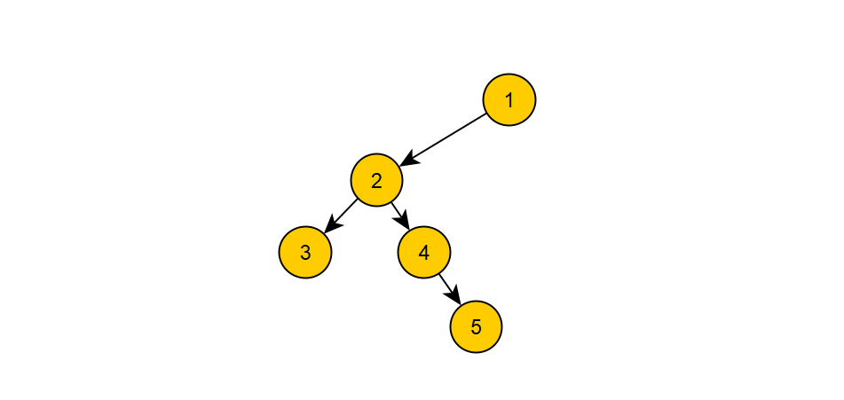

# 面试题8：二叉树的下一个结点

## 题目描述

给定一个二叉树和其中的一个结点，请找出中序遍历顺序的下一个结点并且返回。注意，树中的结点不仅包含左右子结点，同时包含指向父结点的指针。

## 解答

第一种情况：

~~~java
if (pNode.right != null){
    pNode = pNode.right;
    while (pNode.left != null){
        pNode = pNode.left;
    }
    return pNode;
}
~~~

2的下个结点是7，就是如果当前结点有右子树，那么就返回右子树的最左结点

-----------

第二种情况：

~~~java
if (pNode.next != null) {
    TreeLinkNode last = pNode;
    pNode = pNode.next;
    while (!(pNode.left!=null&&pNode.left==last)) {
        last = pNode;
        pNode =pNode.next;
        if (pNode == null) return null;
    }
    return pNode;
}
~~~

5的下一个结点是1，所以要它右边的父节点

----

最后的代码：

~~~java
public class Solution {
    public TreeLinkNode GetNext(TreeLinkNode pNode) {
        if (pNode == null) return null;
        if (pNode.right != null){
            pNode = pNode.right;
            while (pNode.left != null){
                pNode = pNode.left;
            }
            return pNode;
        }
        
        if (pNode.next != null) {
            TreeLinkNode last = pNode;
            pNode = pNode.next;
            while (!(pNode.left!=null&&pNode.left==last)) {
                last = pNode;
                pNode =pNode.next;
                if (pNode == null) return null;
            }
            return pNode;
        }
        return null;
    }
}
~~~

